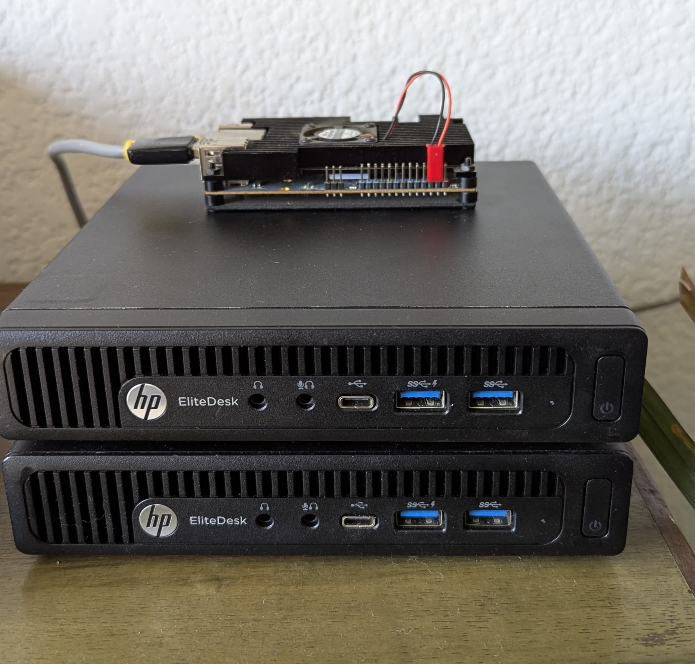

# **Talos Kubernetes Cluster Setup with Kubespan**

This guide provides step-by-step instructions for setting up a **Talos-based Kubernetes cluster** with **Kubespan networking** for secure, encrypted node-to-node communication.

---

## **🚀 Prerequisites**
Ensure you have the following installed on your **local machine**:
- [Talosctl CLI](https://talos.dev/)
- [kubectl](https://kubernetes.io/docs/tasks/tools/)
- **At least 2 nodes** (1 control plane + 1 worker)

---

## **📸 Talos Kubernetes Home Lab**
Here is my **home lab setup** running Talos Linux with Kubespan networking:



---

## **🛠 Step 1: Generate Talos Cluster Configuration**
Run the following command to generate a **Talos Kubernetes configuration** with patches for various configurations:

```sh
mkdir -p rendered
mkdir -p patches
```

```sh
talosctl gen config romulus https://192.168.100.103:6443 \
  --with-secrets secrets.yaml \
  --config-patch @patches/allow-controlplane-workloads.yaml \
  --config-patch @patches/cni.yaml \
  --config-patch @patches/dhcp.yaml \
  --config-patch @patches/install-disk.yaml \
  --config-patch @patches/interface-names.yaml \
  --config-patch @patches/kubelet-certificate.yaml \
  --config-patch-control-plane @patches/vip.yaml \
  --output rendered/
```

---

## **🛠 Step 2: Install Talos on Control Plane Nodes**
### **1️⃣ Apply Configuration to Control Plane Nodes**
```sh
talosctl apply-config -f rendered/controlplane.yaml -n 192.168.100.105 --insecure
talosctl apply-config -f rendered/controlplane.yaml -n 192.168.100.104 --insecure
```

### **2️⃣ Set Talos Configuration File**
```sh
mv rendered/talosconfig ~/.talos/config
```

### **3️⃣ Verify Cluster Members**
```sh
talosctl get members -n 192.168.100.105
```

### **4️⃣ Configure Talos Endpoints**
```sh
talosctl config endpoint 192.168.100.104 192.168.100.105
```

### **5️⃣ Verify Members Again**
```sh
talosctl get members -n 192.168.100.105
```

### **6️⃣ Open Talos Dashboard**
```sh
talosctl dashboard -n 192.168.100.105
```

### **7️⃣ Bootstrap the Kubernetes Cluster**
```sh
talosctl bootstrap -n 192.168.100.105
```

### **8️⃣ Verify Talos Dashboard**
```sh
talosctl dashboard -n 192.168.100.105
```

---

## **🛠 Step 3: Install Talos on Worker Node**
### **1️⃣ Apply Configuration to Worker Node**
```sh
talosctl apply-config -f rendered/worker.yaml -n 192.168.100.104 --insecure
```

### **2️⃣ Verify the Dashboard**
```sh
talosctl dashboard -n 192.168.100.104 -e 192.168.100.105
```

---

## **🛠 Step 4: Verify Cluster & Enable Kubespan Networking**
### **1️⃣ Check Talos Services**
Ensure Talos services are running on all nodes:
```sh
talosctl health -n 192.168.100.105
talosctl health -n 192.168.100.104
```

### **2️⃣ Verify Kubespan**
```sh
talosctl get kubespan -n 192.168.100.105
talosctl get kubespan -n 192.168.100.104
```

Kubespan automatically sets up **WireGuard-based secure networking** between nodes, allowing future **multi-cluster connections** (e.g., cloud, bare-metal, hybrid environments).

---

## **🛠 Step 5: Retrieve Kubernetes Kubeconfig**
To interact with the cluster using `kubectl`:
```sh
talosctl kubeconfig -n 192.168.100.105 --force
kubectl get nodes -o wide
```

---

## **✅ Summary**
| Task  | ✅ Status |
|-----------------------------|------------|
| **Generate Talos Config** | ✅ Done |
| **Install Control Plane** | ✅ Done |
| **Install Worker Node** | ✅ Done |
| **Enable Kubespan** | ✅ Done |
| **Verify Cluster Health** | ✅ Done |
